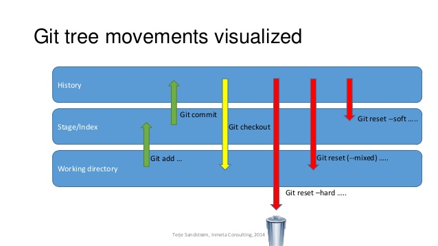

#My Various Cheatsheets

##Spring Tool Suite (3.7.3 RELEASE)
----------
Run an application ([Spring boot](http://projects.spring.io/spring-boot/#quick-start) should be installed)

    mvn spring-boot:run

Build JAR/WAR package

    mvn clean package

Start Tomcat ([Apache Tomcat7 Maven Plugin](http://mvnrepository.com/artifact/org.apache.tomcat.maven/tomcat7-maven-plugin/2.2) required)

    mvn tomcat7:run

##JAVA
----------
Simple way to display an array of string

    System.out.println(Arrays.toString(myStringArray));

## MAVEN
----------
settings.xml file location (Debian based distros)

    /usr/share/maven/conf

##Symfony (2.7)
----------
Create an admin user

    php app/console fos:user:create admin admin@admin.dev admin

##NPM (3.9.2)
----------
Install a npm module and save it to package.json

    npm install <module_name> --save

##Arch Linux (and derivatives)
----------
Clean the package cache (to save space)

    sudo pacman -Sc

Reinstall grub2 (may work on other distributions)

    sudo grub-install --recheck --root-directory=/mnt /dev/sda\n
    sudo grub-mkconfig -o /mnt/boot/grub/grub.cfg

Remove a desktop environement (kde)

    pacman -Rnsc kde
    sudo pacman -Rnsc kde-applications # To remove the DE associated apps

Force quit pacman/yaourt

    sudo rm /var/lib/pacman/db.lck
    
##[Jekyll](https://jekyllrb.com/)
----------
- Any file whose name starts with _ is not imported into the _site folder after "compiling".

##PostgreSQL
----------
Connect to a database

    psql <dbName> <userName>

##Git
Change git default editor

    git config --global core.editor <editor>

Modify last commit

    git commit --amend

Difference between --mixed, --soft, --hard reset (click on image to see source):

[A very good GIT Cheatsheet](http://ndpsoftware.com/git-cheatsheet.html#loc=workspace;)
